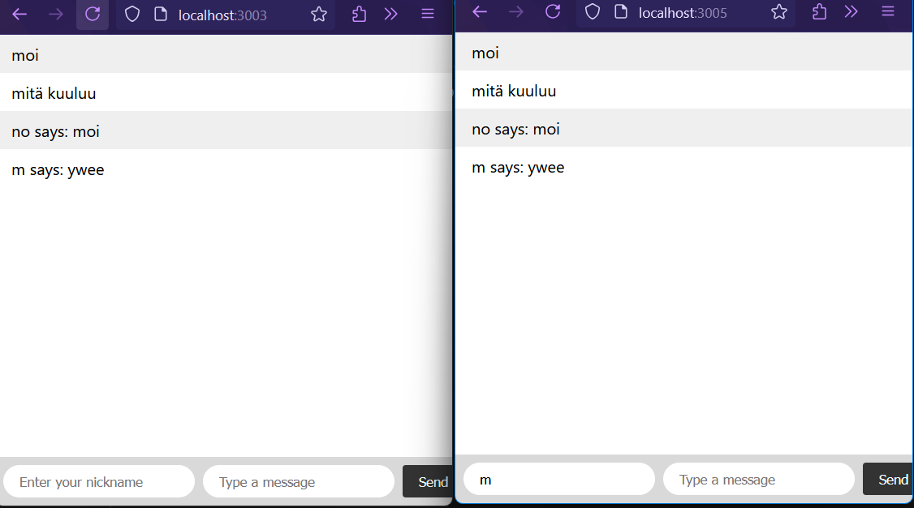

# Socket.IO chat

## Features Implemented

### 1. User Messages Broadcasted to Other Users

- A text input field has been added for users to send messages.
- Messages are successfully broadcasted in real-time to all users connected to the same port.
- Each message is displayed on every user's screen.

### 2. Nicknames

- Users can choose a nickname.
- Messages are broadcasted with the format: `<nickname> says: <message>`.
- The nickname is visible to all users on the same port.

## Feature Not Implemented

### 3. Chat Rooms

- **Chat rooms** functionality has not been fully implemented.
- Users can join the app and send messages, but I didn't manage to separate them into different chat rooms where only one-room messages are visible.

